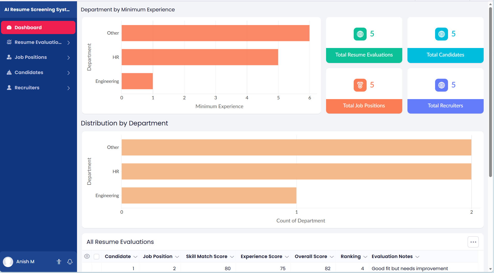
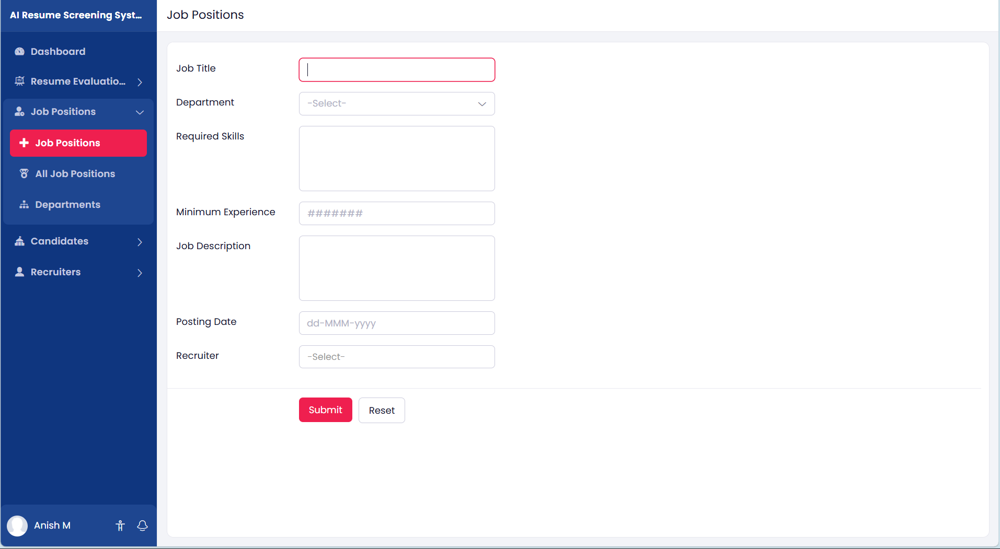
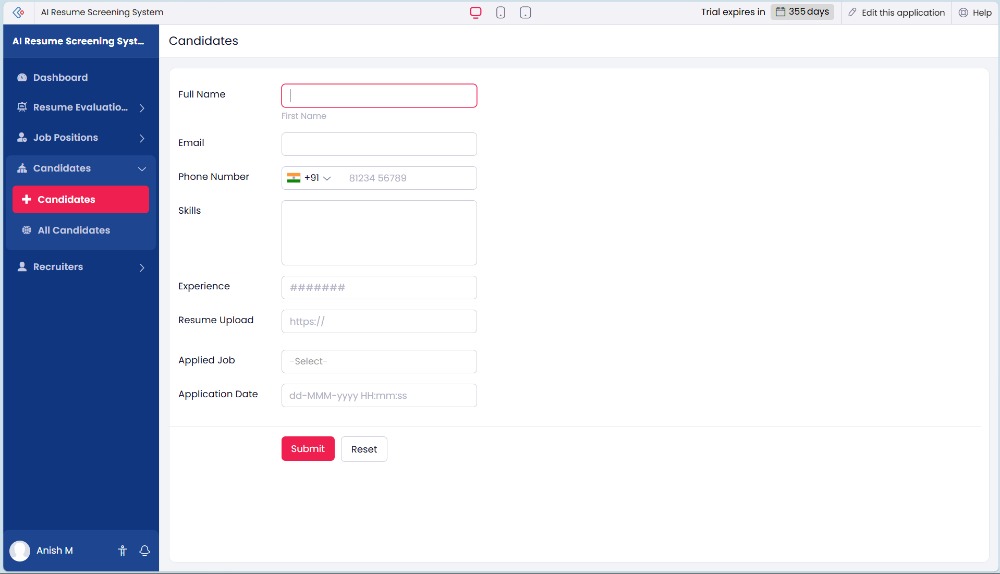
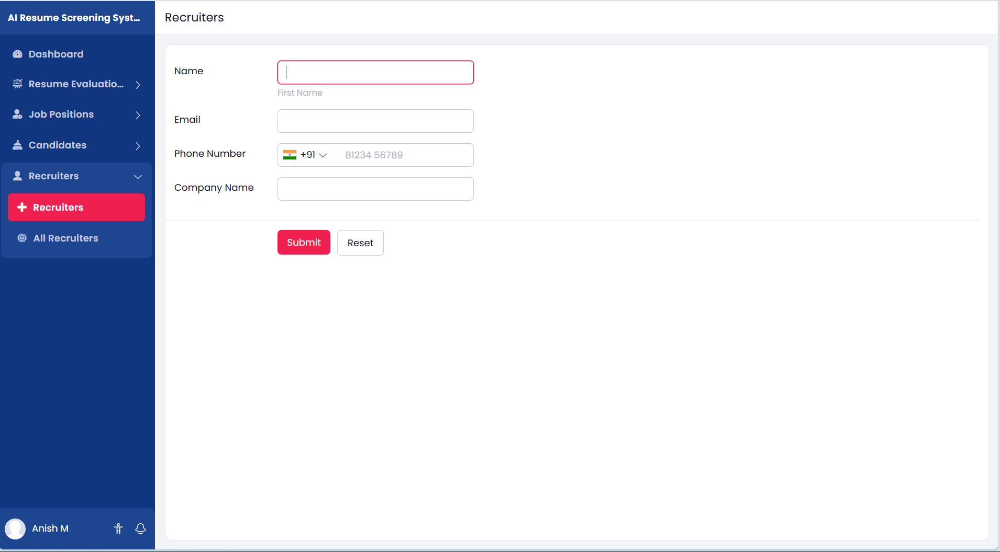

##  Author

**Anish**

Project built using **Zoho Creator** as part of a learning and portfolio project.

# AI Resume Screening System

AI Resume Screening System is a **low-code recruitment management application built using Zoho Creator** that helps recruiters automate resume screening and candidate evaluation.

The system allows recruiters to create job openings, candidates to upload resumes, and automatically evaluates applicants based on **skills, experience, and job requirements**.

# Project Objective

Recruiters often receive hundreds of resumes for a single job role. Manually reviewing them is time-consuming.

This project aims to:

- Automate resume screening
- Rank candidates based on job requirements
- Help recruiters identify the best applicants quickly
- Demonstrate how **AI and low-code development** improve recruitment workflows

# Features

## Job Management
Recruiters can create and manage job openings with detailed descriptions and required skills.

## Candidate Application
Candidates can apply for jobs and upload resumes.

## Resume Evaluation
The system evaluates resumes based on skills and experience.

## Candidate Ranking
Applicants are automatically ranked according to their evaluation score.

## Recruiter Dashboard
Recruiters can monitor:

- Total job openings
- Total applications
- Top candidates
- Recruitment statistics

# System Architecture

# System Modules

## Recruiter Module
Stores recruiter information.

Fields:
- Recruiter ID
- Name
- Email
- Phone Number
- Company Name

---

## Job Position Module

Stores job openings.

Fields:

- Job ID
- Job Title
- Department
- Required Skills
- Minimum Experience
- Job Description
- Posting Date
- Recruiter

## Candidate Module

Stores candidate details and resumes.

Fields:

- Candidate ID
- Full Name
- Email
- Phone Number
- Skills
- Experience
- Resume Upload
- Applied Job
- Application Date

## Resume Evaluation Module

Evaluates candidates.

Fields:

- Evaluation ID
- Candidate
- Job Position
- Skill Match Score
- Experience Score
- Overall Score
- Ranking

# Workflow

1. Recruiter creates a job opening
2. Candidate submits application with resume
3. System stores candidate data
4. Resume is analyzed
5. Candidate receives a score
6. Candidates are ranked
7. Recruiters review top applicants

# Technology Stack

| Technology | Purpose |
|-----------|--------|
| Zoho Creator | Low-code development |
| Zia AI | Resume analysis |
| Deluge Script | Workflow automation |
| Zoho Analytics | Reports and dashboards |

# Future Enhancements

- AI resume skill extraction
- LinkedIn integration
- Interview scheduling automation
- Candidate recommendation system
- Resume plagiarism detection

# Application Screenshots

## Dashboard

## Job Creation Form

## Candidate Application

## Recruiters Application

